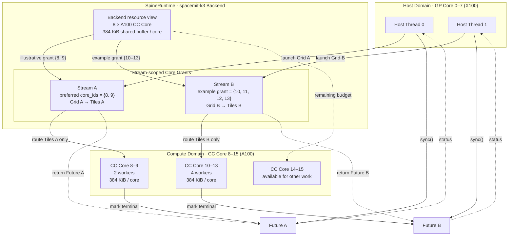
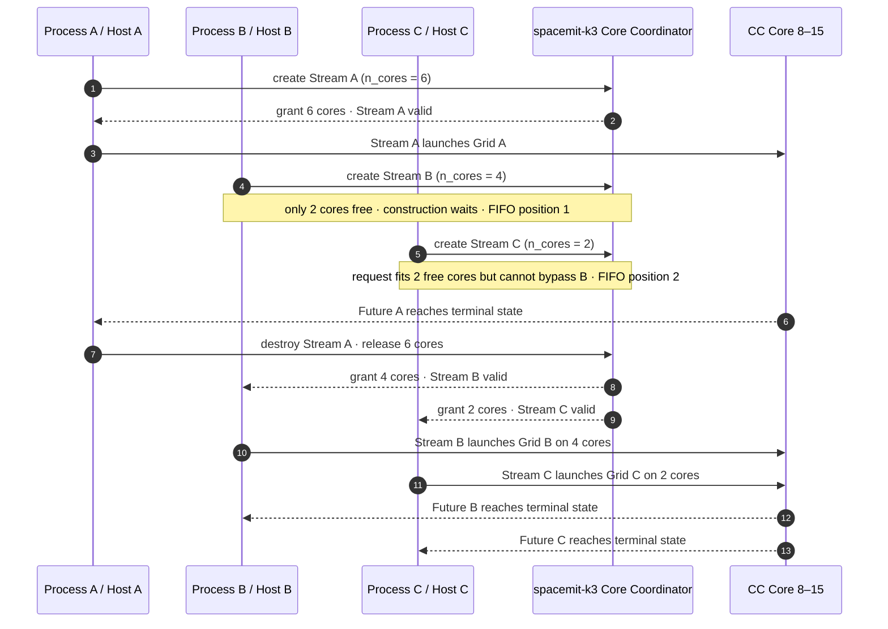

# Multicore Scheduling Model

English | [简体中文](scheduling_ZH.md)

### Streams and Compute-Core Resources

`Stream` is SpineRuntime's unit of multicore execution and resource isolation. When a Stream is created, the runtime requests a set of compute cores from the specified Backend. `n_cores == 0` requests all compute cores that are currently available. An application can also use `StreamConfig::core_ids` to specify preferred physical core IDs. If the exact core set cannot be granted, the runtime falls back to a core-count request.

```cpp
spert::BackendHandle backend = spert::backend("spacemit-k3");
if (!backend.valid()) {
    return 1;
}

spert::StreamConfig config;
config.n_cores = 2;
config.core_ids = {8, 9};

spert::Stream stream(backend, config);
if (!stream.valid()) {
    return 2;
}
```

Each Backend instance maintains independent runtime resources. A process can create multiple Streams, and multiple host threads can concurrently submit tasks to the same Stream. The effective parallelism of different Streams is jointly determined by the compute-core sets granted by the Backend, platform resource availability, and system scheduling policy.

### spacemit-k3 Scheduling Example

The following diagram uses two independent Streams on K3 to illustrate the relationship between Host submission, Backend core grants, tile routing, and Future completion:



The scheduling process shown in the diagram can be understood as follows:

1. Host threads run on K3 GP Cores 0–7 and can submit Grids to Streams separately or concurrently.
2. The `spacemit-k3` Backend exposes eight A100 CC Cores (physical IDs 8–15), each with 384 KiB of shared-buffer capacity.
3. Stream A prefers the core set `{8, 9}`. Both `{8, 9}` and Stream B's `{10, 11, 12, 13}` are example grants when sufficient resources are available. Each Stream's tiles are routed only to its own granted core set.
4. Each CC Core has one resident worker. When a tile waits on a Barrier, Event, Future join, or shared-buffer allocation, it can be cooperatively suspended so that the worker can execute another ready tile.
5. The two `launch` calls return Future A and Future B respectively. After the CC Cores complete the corresponding Grid, they move its Future to a terminal state. The Host can wait for each Future separately or use `Future::sync_all()` to wait for both. Barriers, Events, and in-tile Future joins can be used only within their owning Stream.

The core allocation in the diagram illustrates scheduling relationships only; it is not a fixed partition. Actual grants depend on currently available resources, usage by other Streams or processes, and Backend coordination. Applications should check `Stream::valid()` and obtain the actual core count through `Stream::core_count()`.

#### Scheduling Under Resource Contention

When Streams created by multiple resource-coordinating processes collectively request more cores than K3 currently has available, Stream construction waits during the resource-grant phase. The following example, in which three processes each create one Stream, shows how FIFO fairness prevents a later small request from bypassing an earlier large request:



This contention process follows these rules:

- Count-based requests are all-or-nothing. When Stream B requests four cores, it does not first acquire the two cores currently free; it waits during Stream construction.
- Although Stream C requests only two cores and two cores are free at that point, it arrived after Stream B and therefore cannot bypass the earlier request.
- After Stream A releases its resources, the earlier Stream B is granted four cores first, followed by two cores for Stream C. `launch` can be called only after the grant completes.
- If preferred `core_ids` are configured, the runtime first attempts a non-blocking exact allocation. If that fails, it falls back to a count-based request and may enter the same FIFO wait process.
- If the Backend's bounded wait expires before the request can be satisfied, Stream construction fails. The application detects this through `Stream::valid() == false` and decides whether to retry, degrade gracefully, or exit.

This behavior applies to resource-coordinated SpacemiT hardware Backends. Coordination covers processes and their Streams that follow the same protocol. `generic/qemu` does not provide equivalent cross-process core-budget coordination. Nor is this mechanism kernel-enforced isolation: processes that do not follow the protocol can still cause platform-level contention.

### Tile Scheduling and Cooperation

The runtime prepares resident execution threads on compute cores visible to the Backend and distributes a Stream's tiles across the core set granted to that Stream. When a tile reaches `yield` or waits on a Barrier, Event, `join`, or shared-buffer allocation, it is cooperatively suspended so that the corresponding compute core can continue executing other ready tiles. The tile resumes automatically when the condition is satisfied.

```text
Host Thread(s)
      │ launch
      ▼
    Stream ── Core Grant
      │
      ├── ready tile ───────────────► CC Core worker
      ├── waiting tile ◄── wake ─── Barrier / Event / Future
      └── completed tile ───────────► Future
```

This model provides the following semantics:

- Within one Stream, Barriers, Events, and Future joins can be used for inter-tile cooperation. Cross-Stream use returns `CrossStream`.
- Multiple Streams under the same Backend hold separate core grants and synchronization objects.
- Hardware Backends can coordinate compute-core budgets across multiple processes; final execution remains subject to the platform's kernel scheduling policy.
- When a Stream is destroyed, it automatically stops accepting new tasks, finishes or cancels incomplete tasks, and returns Backend resources.
- The runtime can report invalid arguments, insufficient resources, wait timeouts, cooperative deadlocks, Backend unavailability, and other conditions through status codes.

### Per-Core Shared Buffers

Each compute-core execution thread has a corresponding shared scratchpad. Applications can choose to:

- Use `Context::shared_buffer()` to view the complete shared buffer on the current compute core.
- Use `Context::alloc_shared()` to allocate a slice and release it through `Context::free_shared()`.

