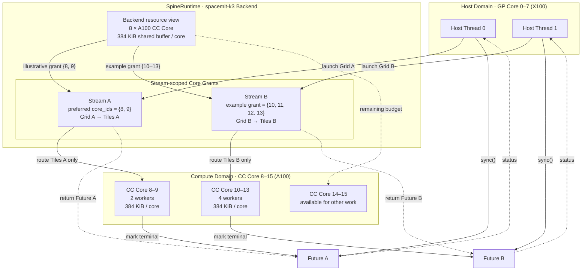
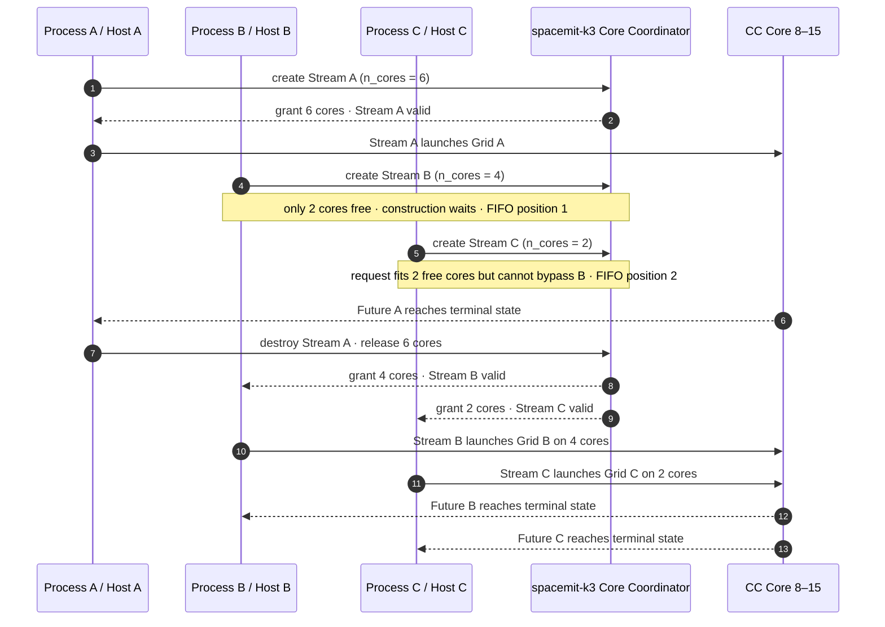

# 多核调度模型

[English](scheduling.md) | 简体中文

### Stream 与计算核资源

`Stream` 是 SpineRuntime 的多核执行与资源隔离单位。创建 Stream 时，运行时向指定 Backend 申请一组计算核；`n_cores == 0` 表示申请当前可用的全部计算核。应用也可以通过 `StreamConfig::core_ids` 指定首选物理核 ID；若精确核集合不可授予，运行时回退到核数量请求。

```cpp
spert::BackendHandle backend = spert::backend("spacemit-k3");
if (!backend.valid()) {
    return 1;
}

spert::StreamConfig config;
config.n_cores = 2;
config.core_ids = {8, 9};

spert::Stream stream(backend, config);
if (!stream.valid()) {
    return 2;
}
```

每个 Backend 实例维护独立的运行时资源。一个进程可以创建多个 Stream，也可以让多个宿主线程并发向同一个 Stream 提交任务。不同 Stream 的实际并行度由 Backend 授予的计算核集合、平台资源状态和系统调度策略共同决定。

### spacemit-k3 调度示例

下图以 K3 上两个相互独立的 Stream 为例，展示 Host 提交、Backend 核授权、tile 路由和 Future 完成之间的关系：



图中的调度过程可以理解为：

1. Host 线程运行在 K3 的 GP Core 0–7 上，可分别或并发地向 Stream 提交 Grid。
2. `spacemit-k3` Backend 向上暴露 8 个 A100 CC Core（物理 ID 8–15），每核提供 384 KiB 共享缓冲区能力。
3. Stream A 以 `{8, 9}` 为首选核集合；图中的 `{8, 9}` 和 Stream B 的 `{10, 11, 12, 13}` 都是资源充足时的示例授权。每个 Stream 的 tile 只路由到自己的获授核集合。
4. 每个 CC Core 对应一个常驻 worker；tile 在 Barrier、Event、Future join 或共享缓冲区等待时可协作式挂起，worker 随后执行其他就绪 tile。
5. 两次 `launch` 分别返回 Future A 和 Future B；CC Core 完成对应 Grid 后将 Future 置为终态，Host 可分别等待，也可使用 `Future::sync_all()` 统一等待。Barrier、Event 和 tile 内的 Future join 只能用于其所属 Stream。

图中的核划分仅用于说明调度关系，并不是固定分区。实际授权取决于当时的可用资源、其他 Stream 或进程的占用以及 Backend 协调结果；应用应检查 `Stream::valid()`，并通过 `Stream::core_count()` 获取实际核数量。

#### 资源竞争时的调度

当多个参与资源协调的进程所创建的 Stream 请求总核数超过 K3 当前可用资源时，Stream 构造会在资源授权阶段等待。下面以三个进程各创建一个 Stream 为例，展示 FIFO 公平性如何避免较晚的小请求绕过较早的大请求：



这个竞争过程体现了以下规则：

- 数量请求采用全有或全无语义。Stream B 请求 4 核时不会先取得当前空闲的 2 核，而是在 Stream 构造阶段等待。
- Stream C 虽然只请求 2 核且当时有 2 核空闲，但它晚于 Stream B 到达，因此不能越过更早的请求。
- Stream A 释放资源后，较早的 Stream B 先获得 4 核，Stream C 随后获得 2 核；授权完成后才能调用 `launch`。
- 若配置了首选 `core_ids`，运行时先尝试非阻塞的精确申请；精确申请失败后回退到数量请求，并可能进入同一 FIFO 等待流程。
- 若 Backend 的有界等待到期仍无法满足请求，Stream 构造失败，应用通过 `Stream::valid() == false` 识别并决定重试、降级或退出。

上述行为适用于启用了资源协调的 SpacemiT 实板 Backend，协调范围覆盖遵守同一协议的进程及其 Stream。`generic/qemu` 不提供等价的跨进程核预算协调；该机制也不是内核强制隔离，不遵守协议的进程仍可能造成平台级竞争。

### Tile 调度与协作

运行时在 Backend 可见的计算核上准备常驻执行线程，并将 Stream 中的 tile 分发到该 Stream 获得的核集合。tile 遇到 `yield`、Barrier、Event、`join` 或共享缓冲区等待时会协作式挂起，使对应计算核可以继续执行其他就绪 tile；条件满足后，tile 自动恢复。

```text
Host Thread(s)
      │ launch
      ▼
    Stream ── Core Grant
      │
      ├── ready tile ───────────────► CC Core worker
      ├── waiting tile ◄── wake ─── Barrier / Event / Future
      └── completed tile ───────────► Future
```

该模型具有以下语义：

- 同一 Stream 内的 Barrier、Event 和 Future join 可用于 tile 间协作；跨 Stream 使用返回 `CrossStream`。
- 同一 Backend 下的多个 Stream 分别持有自己的核授权与同步对象。
- 实板 Backend 可协调多个进程的计算核预算；最终执行仍受平台内核调度策略管理。
- Stream 析构时自动停止接收新任务、结束或取消未完成任务，并归还 Backend 资源。
- 运行时可通过状态码报告参数错误、资源不足、等待超时、协作式死锁和 Backend 不可用等情况。

### 每核共享缓冲区

每个计算核执行线程对应一块共享暂存区。应用可选择：

- 使用 `Context::shared_buffer()` 查看当前执行位置的完整共享缓冲区；
- 使用 `Context::alloc_shared()` 申请一个片段，并通过 `Context::free_shared()` 释放。

